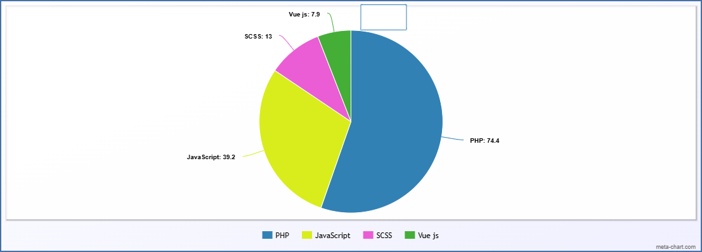

## Teste prático Gosat

Este repositório tem como objetivo fornecer uma API para consulta de credito para um determinado CPF e tambem uma interface frontend para consulta desta API.

Para acessar a interface frontend online acesse https://gosat.matheusnew2.dev.br
Para consultar a api use o prefixo https://gosat.matheusnew2.dev.br/api/v1 e utilize os endpoints que estão no arquivo swagger.yaml neste repositório.

Para executar localmente será necessário o uso do docker.
Para inicar o container copie o arquivo enviado .env para a raiz do projeto.

Clone este repositório após execute os seguintes comando no terminal
```
sudo docker compose up -d
```
```
sudo docker exec -it gosat-php-fpm php artisan migrate --force
```
O comando a seguir testa a aplicação.
```
sudo docker exec -it gosat-php-fpm php artisan test
```
Segue gráfico com as tecnologias usadas

